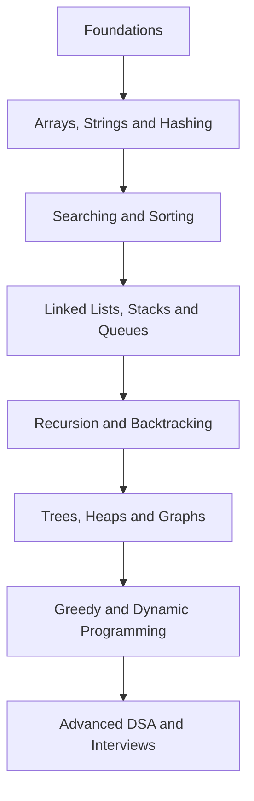

# Master DSA from Beginner to Advanced – Crack FAANG Coding Interviews

> A structured, open-source path from programming fundamentals to advanced DSA, with explanations, patterns, tested solutions and interview preparation.

## Start Here

| Learning path | Best for | Link |
|---|---|---|
| Complete roadmap | Learning DSA in the correct order | [Follow the roadmap](ROADMAP.md) |
| Topic-wise learning | Concepts and structured practice | [Browse topics](#topic-wise-dsa) |
| Problem-solving patterns | Recognizing common solution techniques | [Learn patterns](problem-solving-patterns/README.md) |
| Interview preparation | Revision and technical interviews | [Practice questions](interview-questions/README.md) |
| Company-wise practice | Targeted interview preparation | [Browse companies](interview-questions/company-wise/README.md) |

## DSA Learning Flow

## Topic-wise DSA

| # | Topic | What you will learn | Status |
|---:|---|---|---|
| 01 | [Foundations](01-foundations/README.md) | Complexity, Big O and problem analysis | Started |
| 02 | [Basic Mathematics](02-basic-mathematics/README.md) | GCD, primes, digits and number theory | Planned |
| 03 | [Arrays](03-arrays/README.md) | Traversal, prefix sums, two pointers and Kadane's algorithm | Started |
| 04 | [Searching](04-searching/README.md) | Linear search, binary search and search on answers | Started |
| 05 | [Sorting](05-sorting/README.md) | Basic and efficient sorting algorithms | Planned |
| 06 | [Strings](06-strings/README.md) | Manipulation, matching and string patterns | Planned |
| 07 | [Hashing](07-hashing/README.md) | Maps, sets and frequency techniques | Planned |
| 08 | [Linked Lists](08-linked-lists/README.md) | Singly, doubly and fast-slow pointer problems | Planned |
| 09 | [Stacks and Queues](09-stacks-and-queues/README.md) | Monotonic stacks, queues and deques | Planned |
| 10 | [Recursion and Backtracking](10-recursion-and-backtracking/README.md) | Subsets, permutations and constraint search | Planned |
| 11 | [Bit Manipulation](11-bit-manipulation/README.md) | Bit operators, masks and XOR patterns | Planned |
| 12 | [Trees](12-trees/README.md) | Traversals, views, paths and construction | Planned |
| 13 | [Binary Search Trees](13-binary-search-trees/README.md) | Search, insert, delete and validation | Planned |
| 14 | [Heaps](14-heaps/README.md) | Priority queues and top-k problems | Planned |
| 15 | [Graphs](15-graphs/README.md) | Traversals, shortest paths, MST and topology | Planned |
| 16 | [Greedy Algorithms](16-greedy-algorithms/README.md) | Local choices, intervals and scheduling | Planned |
| 17 | [Dynamic Programming](17-dynamic-programming/README.md) | Memoization, tabulation and DP patterns | Planned |
| 18 | [Tries](18-tries/README.md) | Prefix search and bitwise tries | Planned |
| 19 | [Advanced Data Structures](19-advanced-data-structures/README.md) | DSU, segment trees and Fenwick trees | Planned |

## Featured Problems

| Problem | Difficulty | Pattern | Java solution |
|---|---|---|---|
| [Two Sum](03-arrays/two-sum/README.md) | Easy | Hashing | [View](03-arrays/two-sum/Solution.java) |
| [Binary Search](04-searching/binary-search/README.md) | Easy | Binary search | [View](04-searching/binary-search/Solution.java) |

## How to Use This Repository

1. Follow [ROADMAP.md](ROADMAP.md) in order if you are a beginner.
2. Read the concept before attempting its problems.
3. First write a brute-force solution, then optimize it.
4. Record time and space complexity for every solution.
5. Revisit failed problems after 1, 7 and 30 days.
6. Use interview questions only after completing the related topic.

## Quality Standard

Every completed problem should contain:

- A clear problem statement and constraints
- Examples and edge cases
- Brute-force and optimized approaches
- A dry run of the optimized approach
- Tested implementation
- Time and space complexity
- Related problems and interview follow-ups

## Contributing

Corrections, explanations, test cases and implementations are welcome. Read [CONTRIBUTING.md](CONTRIBUTING.md) before opening a pull request.

## About ExamAdda

[ExamAdda](https://examadda.org) helps learners prepare for software-engineering interviews through structured tutorials, coding practice, system design and interview resources.

## License

This repository is available under the [MIT License](LICENSE).
