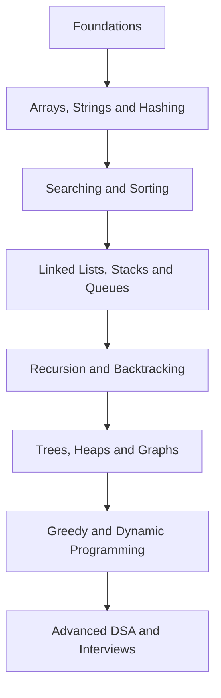

# Master DSA from Beginner to Advanced – Crack FAANG Coding Interviews

> A structured, open-source DSA roadmap featuring clear explanations, essential problem-solving patterns, tested solutions, complexity analysis, and interview-focused practice.

## 🧭 Choose Your DSA Learning Path

Select the path that matches your current goal. If you are just getting started, begin with the **Complete DSA Roadmap** and progress step by step.

| Learning Path | What You’ll Achieve | Best For | Explore |
|---|---|---|---|
|**DSA Roadmap** | Learn every topic in the correct order, from fundamentals to advanced DSA | Beginners and structured learners | [Follow the Roadmap](#dsa-learning-flow) |
|**Topic-Wise Learning** | Understand individual concepts and strengthen them through curated practice | Building strong conceptual foundations | [Browse Topics](#dsa-topics) |
|**Pattern-Wise Practice** | Master reusable techniques such as sliding window, two pointers and binary search | Recognizing solutions faster | [Learn Patterns](./patterns/README.md) |
|**Interview Preparation** | Revise essential concepts and practise frequently asked interview problems | Placements and technical interviews | [Practice Questions](./interview-questions/README.md) |
|**Company-Wise Practice** | Solve problems commonly associated with specific technology companies | Targeting FAANG and product-based companies | [Browse Companies](https://tech.examadda.org/practice/dsa-company-wise) |
|**Quick Revision** | Review important concepts, patterns and complexity rules before an interview | Last-minute interview preparation | [Start Revising](./revision/README.md) |
|**Coding Challenges** | Test your problem-solving skills with mixed and time-bound problem sets | Improving speed, accuracy and confidence | [Take a Challenge](https://www.codechef.com/) |

> **Recommended path:** Roadmap → Topic-Wise Learning → Pattern-Wise Practice → Interview Preparation → Company-Wise Practice

## DSA Learning Flow

## 📚 Topic-Wise DSA Learning

Master Data Structures and Algorithms in a structured order. Each topic includes concept notes, common patterns, complexity analysis, implementation guidance, and carefully selected coding problems.

> **Recommended approach:** Learn the concept → Understand the pattern → Solve basic problems → Attempt interview problems → Review complexity

### Complete DSA Topic List

| No. | Topic | Key Concepts | Difficulty | Resources |
|---:|---|---|---|---|
| 01 | [Programming Foundations](./01-foundations/) | Variables, loops, functions, input/output and complexity basics | Beginner | [Start Learning](./01-foundations/) |
| 02 | [Basic Mathematics](./02-basic-mathematics/) | Digits, divisors, prime numbers, GCD, LCM and modular arithmetic | Beginner | [Explore Problems](./02-basic-mathematics/) |
| 03 | [Arrays](./03-arrays/) | Traversal, prefix sums, subarrays, two pointers and sliding window | Beginner–Advanced | [Explore Problems](./03-arrays/) |
| 04 | [Searching](./04-searching/) | Linear search, binary search and binary search on answers | Beginner–Advanced | [Explore Problems](./04-searching/) |
| 05 | [Sorting](./05-sorting/) | Basic sorting, merge sort, quicksort and custom sorting | Beginner–Advanced | [Explore Problems](./05-sorting/) |
| 06 | [Strings](./06-strings/) | Manipulation, matching, palindromes, KMP and string patterns | Beginner–Advanced | [Explore Problems](./06-strings/) |
| 07 | [Hashing](./07-hashing/) | Frequency counting, hash maps, hash sets and prefix hashing | Beginner–Advanced | [Explore Problems](./07-hashing/) |
| 08 | [Linked Lists](./08-linked-lists/) | Singly, doubly and circular lists; reversal and cycle detection | Beginner–Advanced | [Explore Problems](./08-linked-lists/) |
| 09 | [Stacks and Queues](./09-stacks-and-queues/) | Stack, queue, deque, monotonic stack and monotonic queue | Beginner–Advanced | [Explore Problems](./09-stacks-and-queues/) |
| 10 | [Recursion and Backtracking](./10-recursion-and-backtracking/) | Recursion trees, subsets, permutations, combinations and constraint search | Intermediate–Advanced | [Explore Problems](./10-recursion-and-backtracking/) |
| 11 | [Bit Manipulation](./11-bit-manipulation/) | Bitwise operators, masks, subsets and XOR techniques | Intermediate–Advanced | [Explore Problems](./11-bit-manipulation/) |
| 12 | [Matrices](./12-matrices/) | Matrix traversal, rotation, simulation and grid problems | Beginner–Advanced | [Explore Problems](./12-matrices/) |
| 13 | [Greedy Algorithms](./13-greedy-algorithms/) | Local choices, intervals, scheduling and optimization | Intermediate–Advanced | [Explore Problems](./13-greedy-algorithms/) |
| 14 | [Trees](./14-trees/) | Traversals, views, height, diameter and path-based problems | Intermediate–Advanced | [Explore Problems](./14-trees/) |
| 15 | [Binary Search Trees](./15-binary-search-trees/) | Search, insertion, deletion, validation and order statistics | Intermediate–Advanced | [Explore Problems](./15-binary-search-trees/) |
| 16 | [Heaps and Priority Queues](./16-heaps-and-priority-queues/) | Min/max heaps, top-K problems, scheduling and streaming data | Intermediate–Advanced | [Explore Problems](./16-heaps-and-priority-queues/) |
| 17 | [Tries](./17-tries/) | Prefix trees, word search, autocomplete and XOR tries | Intermediate–Advanced | [Explore Problems](./17-tries/) |
| 18 | [Graphs](./18-graphs/) | BFS, DFS, shortest paths, MST, topological sorting and DSU | Intermediate–Advanced | [Explore Problems](./18-graphs/) |
| 19 | [Dynamic Programming](./19-dynamic-programming/) | Memoization, tabulation, subsequences, grids, strings and stocks | Intermediate–Advanced | [Explore Problems](./19-dynamic-programming/) |
| 20 | [Advanced Data Structures](./20-advanced-data-structures/) | Segment trees, Fenwick trees, sparse tables and disjoint sets | Advanced | [Explore Problems](./20-advanced-data-structures/) |
| 21 | [Advanced Algorithms](./21-advanced-algorithms/) | Advanced graphs, string algorithms, number theory and range queries | Advanced | [Explore Problems](./21-advanced-algorithms/) |

## 🎯 Curated DSA Practice Problems

Strengthen your problem-solving skills with carefully selected questions, detailed explanations, optimized solutions, video tutorials, and hands-on coding practice.

### 01. Arrays

| No. | Problem | Pattern | Difficulty | Companies | Explanation | Code | Video Solution | Practice |
|---:|---|---|:---:|---|:---:|:---:|:---:|:---:|
| 01 | [Largest Element in an Array](./largest-element.md) | Linear Traversal | 🟢 Easy | Amazon, TCS, Wipro | [Read](./largest-element.md) | [View Code](./largest-element.md#solution) | [Watch Video](VIDEO_URL) | [Solve Now](PRACTICE_URL) |
| 02 | [Second-Largest Element](./second-largest-element.md) | Linear Traversal | 🟢 Easy | Amazon, Microsoft, Infosys | [Read](./second-largest-element.md) | [View Code](./second-largest-element.md#solution) | [Watch Video](VIDEO_URL) | [Solve Now](PRACTICE_URL) |
| 03 | [Remove Duplicates from Sorted Array](./remove-duplicates-from-sorted-array.md) | Two Pointers | 🟢 Easy | Amazon, Google, Microsoft | [Read](./remove-duplicates-from-sorted-array.md) | [View Code](./remove-duplicates-from-sorted-array.md#solution) | [Watch Video](VIDEO_URL) | [Solve Now](PRACTICE_URL) |
| 04 | [Move Zeroes to the End](./move-zeroes.md) | Two Pointers | 🟢 Easy | Amazon, Meta, Microsoft | [Read](./move-zeroes.md) | [View Code](./move-zeroes.md#solution) | [Watch Video](VIDEO_URL) | [Solve Now](PRACTICE_URL) |
| 05 | [Rotate Array by K Positions](./rotate-array.md) | Array Reversal | 🟡 Medium | Amazon, Google, Microsoft | [Read](./rotate-array.md) | [View Code](./rotate-array.md#solution) | [Watch Video](VIDEO_URL) | [Solve Now](PRACTICE_URL) |
| 06 | [Two Sum](./two-sum.md) | Hash Map | 🟢 Easy | Amazon, Google, Microsoft | [Read](./two-sum.md) | [View Code](./two-sum.md#solution) | [Watch Video](VIDEO_URL) | [Solve Now](PRACTICE_URL) |
| 07 | [Best Time to Buy and Sell Stock](./best-time-to-buy-and-sell-stock.md) | Running Minimum | 🟢 Easy | Amazon, Meta, Microsoft | [Read](./best-time-to-buy-and-sell-stock.md) | [View Code](./best-time-to-buy-and-sell-stock.md#solution) | [Watch Video](VIDEO_URL) | [Solve Now](PRACTICE_URL) |
| 08 | [Maximum Subarray](./maximum-subarray.md) | Kadane’s Algorithm | 🟡 Medium | Amazon, Google, Microsoft | [Read](./maximum-subarray.md) | [View Code](./maximum-subarray.md#solution) | [Watch Video](VIDEO_URL) | [Solve Now](PRACTICE_URL) |
| 09 | [Three Sum](./three-sum.md) | Sorting + Two Pointers | 🟡 Medium | Amazon, Meta, Adobe | [Read](./three-sum.md) | [View Code](./three-sum.md#solution) | [Watch Video](VIDEO_URL) | [Solve Now](PRACTICE_URL) |
| 10 | [Trapping Rain Water](./trapping-rain-water.md) | Two Pointers | 🔴 Hard | Amazon, Google, Microsoft | [Read](./trapping-rain-water.md) | [View Code](./trapping-rain-water.md#solution) | [Watch Video](VIDEO_URL) | [Solve Now](PRACTICE_URL) |

---

### 02. Searching

| No. | Problem | Pattern | Difficulty | Companies | Explanation | Code | Video Solution | Practice |
|---:|---|---|:---:|---|:---:|:---:|:---:|:---:|
| 01 | [Linear Search](./linear-search.md) | Linear Traversal | 🟢 Easy | TCS, Infosys, Wipro | [Read](./linear-search.md) | [View Code](./linear-search.md#solution) | [Watch Video](VIDEO_URL) | [Solve Now](PRACTICE_URL) |
| 02 | [Binary Search](./binary-search.md) | Binary Search | 🟢 Easy | Amazon, Google, Microsoft | [Read](./binary-search.md) | [View Code](./binary-search.md#solution) | [Watch Video](VIDEO_URL) | [Solve Now](PRACTICE_URL) |
| 03 | [Search Insert Position](./search-insert-position.md) | Lower Bound | 🟢 Easy | Amazon, Google, Microsoft | [Read](./search-insert-position.md) | [View Code](./search-insert-position.md#solution) | [Watch Video](VIDEO_URL) | [Solve Now](PRACTICE_URL) |
| 04 | [First and Last Position](./first-and-last-position.md) | Binary Search | 🟡 Medium | Amazon, Meta, Microsoft | [Read](./first-and-last-position.md) | [View Code](./first-and-last-position.md#solution) | [Watch Video](VIDEO_URL) | [Solve Now](PRACTICE_URL) |
| 05 | [Find Peak Element](./find-peak-element.md) | Binary Search | 🟡 Medium | Amazon, Google, Microsoft | [Read](./find-peak-element.md) | [View Code](./find-peak-element.md#solution) | [Watch Video](VIDEO_URL) | [Solve Now](PRACTICE_URL) |
| 06 | [Search in Rotated Sorted Array](./search-in-rotated-sorted-array.md) | Modified Binary Search | 🟡 Medium | Amazon, Google, Microsoft | [Read](./search-in-rotated-sorted-array.md) | [View Code](./search-in-rotated-sorted-array.md#solution) | [Watch Video](VIDEO_URL) | [Solve Now](PRACTICE_URL) |
| 07 | [Minimum in Rotated Sorted Array](./minimum-in-rotated-sorted-array.md) | Modified Binary Search | 🟡 Medium | Amazon, Meta, Microsoft | [Read](./minimum-in-rotated-sorted-array.md) | [View Code](./minimum-in-rotated-sorted-array.md#solution) | [Watch Video](VIDEO_URL) | [Solve Now](PRACTICE_URL) |
| 08 | [Square Root of a Number](./square-root.md) | Binary Search on Answer | 🟡 Medium | Amazon, Microsoft, TCS | [Read](./square-root.md) | [View Code](./square-root.md#solution) | [Watch Video](VIDEO_URL) | [Solve Now](PRACTICE_URL) |
| 09 | [Koko Eating Bananas](./koko-eating-bananas.md) | Binary Search on Answer | 🟡 Medium | Amazon, Google, Meta | [Read](./koko-eating-bananas.md) | [View Code](./koko-eating-bananas.md#solution) | [Watch Video](VIDEO_URL) | [Solve Now](PRACTICE_URL) |
| 10 | [Median of Two Sorted Arrays](./median-of-two-sorted-arrays.md) | Partitioned Binary Search | 🔴 Hard | Amazon, Google, Microsoft | [Read](./median-of-two-sorted-arrays.md) | [View Code](./median-of-two-sorted-arrays.md#solution) | [Watch Video](VIDEO_URL) | [Solve Now](PRACTICE_URL) |

---

### 03. Sorting

| No. | Problem | Pattern | Difficulty | Companies | Explanation | Code | Video Solution | Practice |
|---:|---|---|:---:|---|:---:|:---:|:---:|:---:|
| 01 | [Bubble Sort](./bubble-sort.md) | Comparison Sorting | 🟢 Easy | TCS, Infosys, Wipro | [Read](./bubble-sort.md) | [View Code](./bubble-sort.md#solution) | [Watch Video](VIDEO_URL) | [Solve Now](PRACTICE_URL) |
| 02 | [Selection Sort](./selection-sort.md) | Comparison Sorting | 🟢 Easy | TCS, Infosys, Accenture | [Read](./selection-sort.md) | [View Code](./selection-sort.md#solution) | [Watch Video](VIDEO_URL) | [Solve Now](PRACTICE_URL) |
| 03 | [Insertion Sort](./insertion-sort.md) | Incremental Sorting | 🟢 Easy | TCS, Wipro, Cognizant | [Read](./insertion-sort.md) | [View Code](./insertion-sort.md#solution) | [Watch Video](VIDEO_URL) | [Solve Now](PRACTICE_URL) |
| 04 | [Merge Sort](./merge-sort.md) | Divide and Conquer | 🟡 Medium | Amazon, Google, Microsoft | [Read](./merge-sort.md) | [View Code](./merge-sort.md#solution) | [Watch Video](VIDEO_URL) | [Solve Now](PRACTICE_URL) |
| 05 | [Quick Sort](./quick-sort.md) | Partitioning | 🟡 Medium | Amazon, Google, Microsoft | [Read](./quick-sort.md) | [View Code](./quick-sort.md#solution) | [Watch Video](VIDEO_URL) | [Solve Now](PRACTICE_URL) |
| 06 | [Sort Colors](./sort-colors.md) | Dutch National Flag | 🟡 Medium | Amazon, Microsoft, Adobe | [Read](./sort-colors.md) | [View Code](./sort-colors.md#solution) | [Watch Video](VIDEO_URL) | [Solve Now](PRACTICE_URL) |
| 07 | [Merge Two Sorted Arrays](./merge-two-sorted-arrays.md) | Two Pointers | 🟢 Easy | Amazon, Google, Microsoft | [Read](./merge-two-sorted-arrays.md) | [View Code](./merge-two-sorted-arrays.md#solution) | [Watch Video](VIDEO_URL) | [Solve Now](PRACTICE_URL) |
| 08 | [Merge Overlapping Intervals](./merge-overlapping-intervals.md) | Interval Sorting | 🟡 Medium | Amazon, Google, Meta | [Read](./merge-overlapping-intervals.md) | [View Code](./merge-overlapping-intervals.md#solution) | [Watch Video](VIDEO_URL) | [Solve Now](PRACTICE_URL) |
| 09 | [Count Inversions](./count-inversions.md) | Modified Merge Sort | 🔴 Hard | Amazon, Microsoft, Adobe | [Read](./count-inversions.md) | [View Code](./count-inversions.md#solution) | [Watch Video](VIDEO_URL) | [Solve Now](PRACTICE_URL) |
| 10 | [Kth-Largest Element](./kth-largest-element.md) | Quickselect | 🟡 Medium | Amazon, Google, Meta | [Read](./kth-largest-element.md) | [View Code](./kth-largest-element.md#solution) | [Watch Video](VIDEO_URL) | [Solve Now](PRACTICE_URL) |

---

### 04. Strings

| No. | Problem | Pattern | Difficulty | Companies | Explanation | Code | Video Solution | Practice |
|---:|---|---|:---:|---|:---:|:---:|:---:|:---:|
| 01 | [Reverse a String](./reverse-a-string.md) | Two Pointers | 🟢 Easy | Amazon, Microsoft, TCS | [Read](./reverse-a-string.md) | [View Code](./reverse-a-string.md#solution) | [Watch Video](VIDEO_URL) | [Solve Now](PRACTICE_URL) |
| 02 | [Valid Palindrome](./valid-palindrome.md) | Two Pointers | 🟢 Easy | Amazon, Meta, Microsoft | [Read](./valid-palindrome.md) | [View Code](./valid-palindrome.md#solution) | [Watch Video](VIDEO_URL) | [Solve Now](PRACTICE_URL) |
| 03 | [Longest Common Prefix](./longest-common-prefix.md) | Vertical Scanning | 🟢 Easy | Amazon, Google, Microsoft | [Read](./longest-common-prefix.md) | [View Code](./longest-common-prefix.md#solution) | [Watch Video](VIDEO_URL) | [Solve Now](PRACTICE_URL) |
| 04 | [Implement strStr](./implement-strstr.md) | String Matching | 🟢 Easy | Amazon, Google, Microsoft | [Read](./implement-strstr.md) | [View Code](./implement-strstr.md#solution) | [Watch Video](VIDEO_URL) | [Solve Now](PRACTICE_URL) |
| 05 | [Longest Substring Without Repeating Characters](./longest-substring-without-repeating.md) | Sliding Window | 🟡 Medium | Amazon, Google, Meta | [Read](./longest-substring-without-repeating.md) | [View Code](./longest-substring-without-repeating.md#solution) | [Watch Video](VIDEO_URL) | [Solve Now](PRACTICE_URL) |
| 06 | [Longest Palindromic Substring](./longest-palindromic-substring.md) | Expand Around Centre | 🟡 Medium | Amazon, Google, Microsoft | [Read](./longest-palindromic-substring.md) | [View Code](./longest-palindromic-substring.md#solution) | [Watch Video](VIDEO_URL) | [Solve Now](PRACTICE_URL) |
| 07 | [String Compression](./string-compression.md) | Two Pointers | 🟡 Medium | Amazon, Google, Meta | [Read](./string-compression.md) | [View Code](./string-compression.md#solution) | [Watch Video](VIDEO_URL) | [Solve Now](PRACTICE_URL) |
| 08 | [Longest Repeating Character Replacement](./longest-repeating-character-replacement.md) | Sliding Window | 🟡 Medium | Amazon, Google, Microsoft | [Read](./longest-repeating-character-replacement.md) | [View Code](./longest-repeating-character-replacement.md#solution) | [Watch Video](VIDEO_URL) | [Solve Now](PRACTICE_URL) |
| 09 | [Minimum Window Substring](./minimum-window-substring.md) | Sliding Window | 🔴 Hard | Amazon, Google, Meta | [Read](./minimum-window-substring.md) | [View Code](./minimum-window-substring.md#solution) | [Watch Video](VIDEO_URL) | [Solve Now](PRACTICE_URL) |
| 10 | [KMP Pattern Searching](./kmp-pattern-searching.md) | Prefix Function | 🔴 Hard | Amazon, Google, Microsoft | [Read](./kmp-pattern-searching.md) | [View Code](./kmp-pattern-searching.md#solution) | [Watch Video](VIDEO_URL) | [Solve Now](PRACTICE_URL) |

---

### 05. Hashing

| No. | Problem | Pattern | Difficulty | Companies | Explanation | Code | Video Solution | Practice |
|---:|---|---|:---:|---|:---:|:---:|:---:|:---:|
| 01 | [Count Element Frequencies](./count-element-frequencies.md) | Frequency Map | 🟢 Easy | TCS, Infosys, Amazon | [Read](./count-element-frequencies.md) | [View Code](./count-element-frequencies.md#solution) | [Watch Video](VIDEO_URL) | [Solve Now](PRACTICE_URL) |
| 02 | [Contains Duplicate](./contains-duplicate.md) | Hash Set | 🟢 Easy | Amazon, Google, Microsoft | [Read](./contains-duplicate.md) | [View Code](./contains-duplicate.md#solution) | [Watch Video](VIDEO_URL) | [Solve Now](PRACTICE_URL) |
| 03 | [Valid Anagram](./valid-anagram.md) | Frequency Map | 🟢 Easy | Amazon, Google, Meta | [Read](./valid-anagram.md) | [View Code](./valid-anagram.md#solution) | [Watch Video](VIDEO_URL) | [Solve Now](PRACTICE_URL) |
| 04 | [Intersection of Two Arrays](./intersection-of-two-arrays.md) | Hash Set | 🟢 Easy | Amazon, Microsoft, Adobe | [Read](./intersection-of-two-arrays.md) | [View Code](./intersection-of-two-arrays.md#solution) | [Watch Video](VIDEO_URL) | [Solve Now](PRACTICE_URL) |
| 05 | [First Unique Character](./first-unique-character.md) | Frequency Map | 🟢 Easy | Amazon, Google, Microsoft | [Read](./first-unique-character.md) | [View Code](./first-unique-character.md#solution) | [Watch Video](VIDEO_URL) | [Solve Now](PRACTICE_URL) |
| 06 | [Group Anagrams](./group-anagrams.md) | Hash Map | 🟡 Medium | Amazon, Google, Meta | [Read](./group-anagrams.md) | [View Code](./group-anagrams.md#solution) | [Watch Video](VIDEO_URL) | [Solve Now](PRACTICE_URL) |
| 07 | [Longest Consecutive Sequence](./longest-consecutive-sequence.md) | Hash Set | 🟡 Medium | Amazon, Google, Microsoft | [Read](./longest-consecutive-sequence.md) | [View Code](./longest-consecutive-sequence.md#solution) | [Watch Video](VIDEO_URL) | [Solve Now](PRACTICE_URL) |
| 08 | [Subarray Sum Equals K](./subarray-sum-equals-k.md) | Prefix Sum + Hash Map | 🟡 Medium | Amazon, Google, Meta | [Read](./subarray-sum-equals-k.md) | [View Code](./subarray-sum-equals-k.md#solution) | [Watch Video](VIDEO_URL) | [Solve Now](PRACTICE_URL) |
| 09 | [Longest Subarray with Sum K](./longest-subarray-with-sum-k.md) | Prefix Sum + Hash Map | 🟡 Medium | Amazon, Microsoft, Adobe | [Read](./longest-subarray-with-sum-k.md) | [View Code](./longest-subarray-with-sum-k.md#solution) | [Watch Video](VIDEO_URL) | [Solve Now](PRACTICE_URL) |
| 10 | [Count Subarrays with Given XOR](./count-subarrays-with-given-xor.md) | Prefix XOR + Hash Map | 🟡 Medium | Amazon, Google, Microsoft | [Read](./count-subarrays-with-given-xor.md) | [View Code](./count-subarrays-with-given-xor.md#solution) | [Watch Video](VIDEO_URL) | [Solve Now](PRACTICE_URL) |

## 🧩 Pattern-Wise DSA Practice

Master the most important problem-solving patterns used in coding interviews. Each section groups related problems so you can learn when to apply a technique, understand its core logic, and recognize it quickly during interviews.

> **Recommended approach:** Understand the pattern → Study a solved example → Complete easy problems → Attempt medium and hard variations

---

### 01. Two Pointers

| No. | Problem | Key Variation | Difficulty | Companies | Explanation | Code | Video Solution | Practice |
|---:|---|---|:---:|---|:---:|:---:|:---:|:---:|
| 01 | [Valid Palindrome](./two-pointers/valid-palindrome.md) | Opposite-Direction Pointers | 🟢 Easy | Amazon, Meta, Microsoft | [Read](./two-pointers/valid-palindrome.md) | [View Code](./two-pointers/valid-palindrome.md#solution) | [Watch Video](VIDEO_URL) | [Solve Now](PRACTICE_URL) |
| 02 | [Remove Duplicates from Sorted Array](./two-pointers/remove-duplicates.md) | Slow and Fast Pointers | 🟢 Easy | Amazon, Google, Microsoft | [Read](./two-pointers/remove-duplicates.md) | [View Code](./two-pointers/remove-duplicates.md#solution) | [Watch Video](VIDEO_URL) | [Solve Now](PRACTICE_URL) |
| 03 | [Move Zeroes](./two-pointers/move-zeroes.md) | Read and Write Pointers | 🟢 Easy | Amazon, Meta, Microsoft | [Read](./two-pointers/move-zeroes.md) | [View Code](./two-pointers/move-zeroes.md#solution) | [Watch Video](VIDEO_URL) | [Solve Now](PRACTICE_URL) |
| 04 | [Two Sum II](./two-pointers/two-sum-ii.md) | Sorted Pair Search | 🟡 Medium | Amazon, Google, Microsoft | [Read](./two-pointers/two-sum-ii.md) | [View Code](./two-pointers/two-sum-ii.md#solution) | [Watch Video](VIDEO_URL) | [Solve Now](PRACTICE_URL) |
| 05 | [Container With Most Water](./two-pointers/container-with-most-water.md) | Greedy Pointer Movement | 🟡 Medium | Amazon, Google, Meta | [Read](./two-pointers/container-with-most-water.md) | [View Code](./two-pointers/container-with-most-water.md#solution) | [Watch Video](VIDEO_URL) | [Solve Now](PRACTICE_URL) |
| 06 | [Three Sum](./two-pointers/three-sum.md) | Sorting and Pair Search | 🟡 Medium | Amazon, Meta, Adobe | [Read](./two-pointers/three-sum.md) | [View Code](./two-pointers/three-sum.md#solution) | [Watch Video](VIDEO_URL) | [Solve Now](PRACTICE_URL) |
| 07 | [Four Sum](./two-pointers/four-sum.md) | Nested Pair Search | 🟡 Medium | Amazon, Google, Microsoft | [Read](./two-pointers/four-sum.md) | [View Code](./two-pointers/four-sum.md#solution) | [Watch Video](VIDEO_URL) | [Solve Now](PRACTICE_URL) |
| 08 | [Sort Colors](./two-pointers/sort-colors.md) | Three Pointers | 🟡 Medium | Amazon, Microsoft, Adobe | [Read](./two-pointers/sort-colors.md) | [View Code](./two-pointers/sort-colors.md#solution) | [Watch Video](VIDEO_URL) | [Solve Now](PRACTICE_URL) |
| 09 | [Trapping Rain Water](./two-pointers/trapping-rain-water.md) | Boundary Maximums | 🔴 Hard | Amazon, Google, Microsoft | [Read](./two-pointers/trapping-rain-water.md) | [View Code](./two-pointers/trapping-rain-water.md#solution) | [Watch Video](VIDEO_URL) | [Solve Now](PRACTICE_URL) |
| 10 | [Minimum Window Subsequence](./two-pointers/minimum-window-subsequence.md) | Forward and Backward Scan | 🔴 Hard | Amazon, Google, Meta | [Read](./two-pointers/minimum-window-subsequence.md) | [View Code](./two-pointers/minimum-window-subsequence.md#solution) | [Watch Video](VIDEO_URL) | [Solve Now](PRACTICE_URL) |

---

### 02. Sliding Window

| No. | Problem | Key Variation | Difficulty | Companies | Explanation | Code | Video Solution | Practice |
|---:|---|---|:---:|---|:---:|:---:|:---:|:---:|
| 01 | [Maximum Sum Subarray of Size K](./sliding-window/maximum-sum-size-k.md) | Fixed Window | 🟢 Easy | Amazon, Microsoft, Adobe | [Read](./sliding-window/maximum-sum-size-k.md) | [View Code](./sliding-window/maximum-sum-size-k.md#solution) | [Watch Video](VIDEO_URL) | [Solve Now](PRACTICE_URL) |
| 02 | [Maximum Average Subarray](./sliding-window/maximum-average-subarray.md) | Fixed Window | 🟢 Easy | Amazon, Google, Meta | [Read](./sliding-window/maximum-average-subarray.md) | [View Code](./sliding-window/maximum-average-subarray.md#solution) | [Watch Video](VIDEO_URL) | [Solve Now](PRACTICE_URL) |
| 03 | [Longest Substring Without Repeating Characters](./sliding-window/longest-substring-without-repeating.md) | Variable Window | 🟡 Medium | Amazon, Google, Meta | [Read](./sliding-window/longest-substring-without-repeating.md) | [View Code](./sliding-window/longest-substring-without-repeating.md#solution) | [Watch Video](VIDEO_URL) | [Solve Now](PRACTICE_URL) |
| 04 | [Minimum Size Subarray Sum](./sliding-window/minimum-size-subarray-sum.md) | Shrinking Window | 🟡 Medium | Amazon, Google, Microsoft | [Read](./sliding-window/minimum-size-subarray-sum.md) | [View Code](./sliding-window/minimum-size-subarray-sum.md#solution) | [Watch Video](VIDEO_URL) | [Solve Now](PRACTICE_URL) |
| 05 | [Permutation in String](./sliding-window/permutation-in-string.md) | Frequency Window | 🟡 Medium | Amazon, Microsoft, Adobe | [Read](./sliding-window/permutation-in-string.md) | [View Code](./sliding-window/permutation-in-string.md#solution) | [Watch Video](VIDEO_URL) | [Solve Now](PRACTICE_URL) |
| 06 | [Find All Anagrams in a String](./sliding-window/find-all-anagrams.md) | Frequency Window | 🟡 Medium | Amazon, Google, Meta | [Read](./sliding-window/find-all-anagrams.md) | [View Code](./sliding-window/find-all-anagrams.md#solution) | [Watch Video](VIDEO_URL) | [Solve Now](PRACTICE_URL) |
| 07 | [Longest Repeating Character Replacement](./sliding-window/character-replacement.md) | Maximum-Frequency Window | 🟡 Medium | Amazon, Google, Microsoft | [Read](./sliding-window/character-replacement.md) | [View Code](./sliding-window/character-replacement.md#solution) | [Watch Video](VIDEO_URL) | [Solve Now](PRACTICE_URL) |
| 08 | [Fruits into Baskets](./sliding-window/fruits-into-baskets.md) | At-Most-K Distinct | 🟡 Medium | Amazon, Google, Microsoft | [Read](./sliding-window/fruits-into-baskets.md) | [View Code](./sliding-window/fruits-into-baskets.md#solution) | [Watch Video](VIDEO_URL) | [Solve Now](PRACTICE_URL) |
| 09 | [Sliding Window Maximum](./sliding-window/sliding-window-maximum.md) | Monotonic Deque | 🔴 Hard | Amazon, Google, Microsoft | [Read](./sliding-window/sliding-window-maximum.md) | [View Code](./sliding-window/sliding-window-maximum.md#solution) | [Watch Video](VIDEO_URL) | [Solve Now](PRACTICE_URL) |
| 10 | [Minimum Window Substring](./sliding-window/minimum-window-substring.md) | Minimum Valid Window | 🔴 Hard | Amazon, Google, Meta | [Read](./sliding-window/minimum-window-substring.md) | [View Code](./sliding-window/minimum-window-substring.md#solution) | [Watch Video](VIDEO_URL) | [Solve Now](PRACTICE_URL) |

---

### 03. Binary Search

| No. | Problem | Key Variation | Difficulty | Companies | Explanation | Code | Video Solution | Practice |
|---:|---|---|:---:|---|:---:|:---:|:---:|:---:|
| 01 | [Binary Search](./binary-search/binary-search.md) | Exact Search | 🟢 Easy | Amazon, Google, Microsoft | [Read](./binary-search/binary-search.md) | [View Code](./binary-search/binary-search.md#solution) | [Watch Video](VIDEO_URL) | [Solve Now](PRACTICE_URL) |
| 02 | [Search Insert Position](./binary-search/search-insert-position.md) | Lower Bound | 🟢 Easy | Amazon, Google, Microsoft | [Read](./binary-search/search-insert-position.md) | [View Code](./binary-search/search-insert-position.md#solution) | [Watch Video](VIDEO_URL) | [Solve Now](PRACTICE_URL) |
| 03 | [First and Last Position](./binary-search/first-and-last-position.md) | Boundary Search | 🟡 Medium | Amazon, Meta, Microsoft | [Read](./binary-search/first-and-last-position.md) | [View Code](./binary-search/first-and-last-position.md#solution) | [Watch Video](VIDEO_URL) | [Solve Now](PRACTICE_URL) |
| 04 | [Find Peak Element](./binary-search/find-peak-element.md) | Search-Space Reduction | 🟡 Medium | Amazon, Google, Microsoft | [Read](./binary-search/find-peak-element.md) | [View Code](./binary-search/find-peak-element.md#solution) | [Watch Video](VIDEO_URL) | [Solve Now](PRACTICE_URL) |
| 05 | [Search in Rotated Sorted Array](./binary-search/search-rotated-array.md) | Modified Binary Search | 🟡 Medium | Amazon, Google, Microsoft | [Read](./binary-search/search-rotated-array.md) | [View Code](./binary-search/search-rotated-array.md#solution) | [Watch Video](VIDEO_URL) | [Solve Now](PRACTICE_URL) |
| 06 | [Find Minimum in Rotated Sorted Array](./binary-search/minimum-rotated-array.md) | Pivot Search | 🟡 Medium | Amazon, Meta, Microsoft | [Read](./binary-search/minimum-rotated-array.md) | [View Code](./binary-search/minimum-rotated-array.md#solution) | [Watch Video](VIDEO_URL) | [Solve Now](PRACTICE_URL) |
| 07 | [Koko Eating Bananas](./binary-search/koko-eating-bananas.md) | Binary Search on Answer | 🟡 Medium | Amazon, Google, Meta | [Read](./binary-search/koko-eating-bananas.md) | [View Code](./binary-search/koko-eating-bananas.md#solution) | [Watch Video](VIDEO_URL) | [Solve Now](PRACTICE_URL) |
| 08 | [Capacity to Ship Packages](./binary-search/capacity-to-ship-packages.md) | Binary Search on Answer | 🟡 Medium | Amazon, Google, Microsoft | [Read](./binary-search/capacity-to-ship-packages.md) | [View Code](./binary-search/capacity-to-ship-packages.md#solution) | [Watch Video](VIDEO_URL) | [Solve Now](PRACTICE_URL) |
| 09 | [Split Array Largest Sum](./binary-search/split-array-largest-sum.md) | Minimize the Maximum | 🔴 Hard | Amazon, Google, Meta | [Read](./binary-search/split-array-largest-sum.md) | [View Code](./binary-search/split-array-largest-sum.md#solution) | [Watch Video](VIDEO_URL) | [Solve Now](PRACTICE_URL) |
| 10 | [Median of Two Sorted Arrays](./binary-search/median-two-sorted-arrays.md) | Partitioned Binary Search | 🔴 Hard | Amazon, Google, Microsoft | [Read](./binary-search/median-two-sorted-arrays.md) | [View Code](./binary-search/median-two-sorted-arrays.md#solution) | [Watch Video](VIDEO_URL) | [Solve Now](PRACTICE_URL) |

---

### 04. Prefix Sum

| No. | Problem | Key Variation | Difficulty | Companies | Explanation | Code | Video Solution | Practice |
|---:|---|---|:---:|---|:---:|:---:|:---:|:---:|
| 01 | [Running Sum of an Array](./prefix-sum/running-sum.md) | Basic Prefix Sum | 🟢 Easy | Amazon, Microsoft, Adobe | [Read](./prefix-sum/running-sum.md) | [View Code](./prefix-sum/running-sum.md#solution) | [Watch Video](VIDEO_URL) | [Solve Now](PRACTICE_URL) |
| 02 | [Find Pivot Index](./prefix-sum/find-pivot-index.md) | Left and Right Sum | 🟢 Easy | Amazon, Google, Microsoft | [Read](./prefix-sum/find-pivot-index.md) | [View Code](./prefix-sum/find-pivot-index.md#solution) | [Watch Video](VIDEO_URL) | [Solve Now](PRACTICE_URL) |
| 03 | [Range Sum Query](./prefix-sum/range-sum-query.md) | Static Range Query | 🟢 Easy | Amazon, Google, Meta | [Read](./prefix-sum/range-sum-query.md) | [View Code](./prefix-sum/range-sum-query.md#solution) | [Watch Video](VIDEO_URL) | [Solve Now](PRACTICE_URL) |
| 04 | [Product of Array Except Self](./prefix-sum/product-except-self.md) | Prefix and Suffix Products | 🟡 Medium | Amazon, Google, Meta | [Read](./prefix-sum/product-except-self.md) | [View Code](./prefix-sum/product-except-self.md#solution) | [Watch Video](VIDEO_URL) | [Solve Now](PRACTICE_URL) |
| 05 | [Subarray Sum Equals K](./prefix-sum/subarray-sum-equals-k.md) | Prefix Sum and Hash Map | 🟡 Medium | Amazon, Google, Meta | [Read](./prefix-sum/subarray-sum-equals-k.md) | [View Code](./prefix-sum/subarray-sum-equals-k.md#solution) | [Watch Video](VIDEO_URL) | [Solve Now](PRACTICE_URL) |
| 06 | [Longest Subarray with Sum K](./prefix-sum/longest-subarray-sum-k.md) | Earliest Prefix Index | 🟡 Medium | Amazon, Microsoft, Adobe | [Read](./prefix-sum/longest-subarray-sum-k.md) | [View Code](./prefix-sum/longest-subarray-sum-k.md#solution) | [Watch Video](VIDEO_URL) | [Solve Now](PRACTICE_URL) |
| 07 | [Continuous Subarray Sum](./prefix-sum/continuous-subarray-sum.md) | Prefix Remainder | 🟡 Medium | Amazon, Google, Meta | [Read](./prefix-sum/continuous-subarray-sum.md) | [View Code](./prefix-sum/continuous-subarray-sum.md#solution) | [Watch Video](VIDEO_URL) | [Solve Now](PRACTICE_URL) |
| 08 | [Subarray Sums Divisible by K](./prefix-sum/subarrays-divisible-by-k.md) | Remainder Frequency | 🟡 Medium | Amazon, Google, Microsoft | [Read](./prefix-sum/subarrays-divisible-by-k.md) | [View Code](./prefix-sum/subarrays-divisible-by-k.md#solution) | [Watch Video](VIDEO_URL) | [Solve Now](PRACTICE_URL) |
| 09 | [Range Sum Query 2D](./prefix-sum/range-sum-query-2d.md) | Two-Dimensional Prefix Sum | 🟡 Medium | Amazon, Google, Microsoft | [Read](./prefix-sum/range-sum-query-2d.md) | [View Code](./prefix-sum/range-sum-query-2d.md#solution) | [Watch Video](VIDEO_URL) | [Solve Now](PRACTICE_URL) |
| 10 | [Maximum Submatrix Sum](./prefix-sum/maximum-submatrix-sum.md) | 2D Prefix Sum + Kadane | 🔴 Hard | Amazon, Google, Microsoft | [Read](./prefix-sum/maximum-submatrix-sum.md) | [View Code](./prefix-sum/maximum-submatrix-sum.md#solution) | [Watch Video](VIDEO_URL) | [Solve Now](PRACTICE_URL) |

---

### 05. Fast and Slow Pointers

| No. | Problem | Key Variation | Difficulty | Companies | Explanation | Code | Video Solution | Practice |
|---:|---|---|:---:|---|:---:|:---:|:---:|:---:|
| 01 | [Middle of the Linked List](./fast-slow-pointers/middle-linked-list.md) | Different Pointer Speeds | 🟢 Easy | Amazon, Microsoft, Adobe | [Read](./fast-slow-pointers/middle-linked-list.md) | [View Code](./fast-slow-pointers/middle-linked-list.md#solution) | [Watch Video](VIDEO_URL) | [Solve Now](PRACTICE_URL) |
| 02 | [Linked List Cycle](./fast-slow-pointers/linked-list-cycle.md) | Floyd’s Cycle Detection | 🟢 Easy | Amazon, Google, Microsoft | [Read](./fast-slow-pointers/linked-list-cycle.md) | [View Code](./fast-slow-pointers/linked-list-cycle.md#solution) | [Watch Video](VIDEO_URL) | [Solve Now](PRACTICE_URL) |
| 03 | [Linked List Cycle II](./fast-slow-pointers/linked-list-cycle-ii.md) | Cycle Starting Point | 🟡 Medium | Amazon, Google, Meta | [Read](./fast-slow-pointers/linked-list-cycle-ii.md) | [View Code](./fast-slow-pointers/linked-list-cycle-ii.md#solution) | [Watch Video](VIDEO_URL) | [Solve Now](PRACTICE_URL) |
| 04 | [Happy Number](./fast-slow-pointers/happy-number.md) | Implicit Cycle Detection | 🟢 Easy | Amazon, Google, Microsoft | [Read](./fast-slow-pointers/happy-number.md) | [View Code](./fast-slow-pointers/happy-number.md#solution) | [Watch Video](VIDEO_URL) | [Solve Now](PRACTICE_URL) |
| 05 | [Palindrome Linked List](./fast-slow-pointers/palindrome-linked-list.md) | Middle + Reversal | 🟢 Easy | Amazon, Meta, Microsoft | [Read](./fast-slow-pointers/palindrome-linked-list.md) | [View Code](./fast-slow-pointers/palindrome-linked-list.md#solution) | [Watch Video](VIDEO_URL) | [Solve Now](PRACTICE_URL) |
| 06 | [Reorder List](./fast-slow-pointers/reorder-list.md) | Middle + Reverse + Merge | 🟡 Medium | Amazon, Google, Meta | [Read](./fast-slow-pointers/reorder-list.md) | [View Code](./fast-slow-pointers/reorder-list.md#solution) | [Watch Video](VIDEO_URL) | [Solve Now](PRACTICE_URL) |
| 07 | [Remove Nth Node from End](./fast-slow-pointers/remove-nth-node.md) | Fixed Pointer Gap | 🟡 Medium | Amazon, Google, Microsoft | [Read](./fast-slow-pointers/remove-nth-node.md) | [View Code](./fast-slow-pointers/remove-nth-node.md#solution) | [Watch Video](VIDEO_URL) | [Solve Now](PRACTICE_URL) |
| 08 | [Find Duplicate Number](./fast-slow-pointers/find-duplicate-number.md) | Array as Linked List | 🟡 Medium | Amazon, Google, Microsoft | [Read](./fast-slow-pointers/find-duplicate-number.md) | [View Code](./fast-slow-pointers/find-duplicate-number.md#solution) | [Watch Video](VIDEO_URL) | [Solve Now](PRACTICE_URL) |
| 09 | [Circular Array Loop](./fast-slow-pointers/circular-array-loop.md) | Directional Cycle Detection | 🟡 Medium | Amazon, Google, Microsoft | [Read](./fast-slow-pointers/circular-array-loop.md) | [View Code](./fast-slow-pointers/circular-array-loop.md#solution) | [Watch Video](VIDEO_URL) | [Solve Now](PRACTICE_URL) |
| 10 | [Cycle Length in a Linked List](./fast-slow-pointers/cycle-length.md) | Cycle Measurement | 🟡 Medium | Amazon, Microsoft, Adobe | [Read](./fast-slow-pointers/cycle-length.md) | [View Code](./fast-slow-pointers/cycle-length.md#solution) | [Watch Video](VIDEO_URL) | [Solve Now](PRACTICE_URL) |

---

### 06. Monotonic Stack

| No. | Problem | Key Variation | Difficulty | Companies | Explanation | Code | Video Solution | Practice |
|---:|---|---|:---:|---|:---:|:---:|:---:|:---:|
| 01 | [Next Greater Element I](./monotonic-stack/next-greater-element-i.md) | Decreasing Stack | 🟢 Easy | Amazon, Google, Microsoft | [Read](./monotonic-stack/next-greater-element-i.md) | [View Code](./monotonic-stack/next-greater-element-i.md#solution) | [Watch Video](VIDEO_URL) | [Solve Now](PRACTICE_URL) |
| 02 | [Next Greater Element II](./monotonic-stack/next-greater-element-ii.md) | Circular Array | 🟡 Medium | Amazon, Google, Microsoft | [Read](./monotonic-stack/next-greater-element-ii.md) | [View Code](./monotonic-stack/next-greater-element-ii.md#solution) | [Watch Video](VIDEO_URL) | [Solve Now](PRACTICE_URL) |
| 03 | [Next Smaller Element](./monotonic-stack/next-smaller-element.md) | Increasing Stack | 🟢 Easy | Amazon, Microsoft, Adobe | [Read](./monotonic-stack/next-smaller-element.md) | [View Code](./monotonic-stack/next-smaller-element.md#solution) | [Watch Video](VIDEO_URL) | [Solve Now](PRACTICE_URL) |
| 04 | [Daily Temperatures](./monotonic-stack/daily-temperatures.md) | Index Stack | 🟡 Medium | Amazon, Google, Meta | [Read](./monotonic-stack/daily-temperatures.md) | [View Code](./monotonic-stack/daily-temperatures.md#solution) | [Watch Video](VIDEO_URL) | [Solve Now](PRACTICE_URL) |
| 05 | [Stock Span](./monotonic-stack/stock-span.md) | Previous Greater Element | 🟡 Medium | Amazon, Microsoft, Adobe | [Read](./monotonic-stack/stock-span.md) | [View Code](./monotonic-stack/stock-span.md#solution) | [Watch Video](VIDEO_URL) | [Solve Now](PRACTICE_URL) |
| 06 | [Remove K Digits](./monotonic-stack/remove-k-digits.md) | Greedy Stack | 🟡 Medium | Amazon, Google, Microsoft | [Read](./monotonic-stack/remove-k-digits.md) | [View Code](./monotonic-stack/remove-k-digits.md#solution) | [Watch Video](VIDEO_URL) | [Solve Now](PRACTICE_URL) |
| 07 | [Sum of Subarray Minimums](./monotonic-stack/sum-subarray-minimums.md) | Contribution Technique | 🟡 Medium | Amazon, Google, Meta | [Read](./monotonic-stack/sum-subarray-minimums.md) | [View Code](./monotonic-stack/sum-subarray-minimums.md#solution) | [Watch Video](VIDEO_URL) | [Solve Now](PRACTICE_URL) |
| 08 | [Largest Rectangle in Histogram](./monotonic-stack/largest-rectangle-histogram.md) | Boundary Stack | 🔴 Hard | Amazon, Google, Microsoft | [Read](./monotonic-stack/largest-rectangle-histogram.md) | [View Code](./monotonic-stack/largest-rectangle-histogram.md#solution) | [Watch Video](VIDEO_URL) | [Solve Now](PRACTICE_URL) |
| 09 | [Maximal Rectangle](./monotonic-stack/maximal-rectangle.md) | Histogram Transformation | 🔴 Hard | Amazon, Google, Meta | [Read](./monotonic-stack/maximal-rectangle.md) | [View Code](./monotonic-stack/maximal-rectangle.md#solution) | [Watch Video](VIDEO_URL) | [Solve Now](PRACTICE_URL) |
| 10 | [Trapping Rain Water Using Stack](./monotonic-stack/trapping-rain-water.md) | Bounded Region Stack | 🔴 Hard | Amazon, Google, Microsoft | [Read](./monotonic-stack/trapping-rain-water.md) | [View Code](./monotonic-stack/trapping-rain-water.md#solution) | [Watch Video](VIDEO_URL) | [Solve Now](PRACTICE_URL) |

---

### 07. Backtracking

| No. | Problem | Key Variation | Difficulty | Companies | Explanation | Code | Video Solution | Practice |
|---:|---|---|:---:|---|:---:|:---:|:---:|:---:|
| 01 | [Generate All Subsets](./backtracking/subsets.md) | Include or Exclude | 🟡 Medium | Amazon, Google, Meta | [Read](./backtracking/subsets.md) | [View Code](./backtracking/subsets.md#solution) | [Watch Video](VIDEO_URL) | [Solve Now](PRACTICE_URL) |
| 02 | [Subsets II](./backtracking/subsets-ii.md) | Skip Duplicates | 🟡 Medium | Amazon, Google, Microsoft | [Read](./backtracking/subsets-ii.md) | [View Code](./backtracking/subsets-ii.md#solution) | [Watch Video](VIDEO_URL) | [Solve Now](PRACTICE_URL) |
| 03 | [Permutations](./backtracking/permutations.md) | Used-Element Tracking | 🟡 Medium | Amazon, Google, Meta | [Read](./backtracking/permutations.md) | [View Code](./backtracking/permutations.md#solution) | [Watch Video](VIDEO_URL) | [Solve Now](PRACTICE_URL) |
| 04 | [Combination Sum](./backtracking/combination-sum.md) | Reusable Choices | 🟡 Medium | Amazon, Google, Microsoft | [Read](./backtracking/combination-sum.md) | [View Code](./backtracking/combination-sum.md#solution) | [Watch Video](VIDEO_URL) | [Solve Now](PRACTICE_URL) |
| 05 | [Letter Combinations of a Phone Number](./backtracking/phone-letter-combinations.md) | Multi-Choice Recursion | 🟡 Medium | Amazon, Google, Meta | [Read](./backtracking/phone-letter-combinations.md) | [View Code](./backtracking/phone-letter-combinations.md#solution) | [Watch Video](VIDEO_URL) | [Solve Now](PRACTICE_URL) |
| 06 | [Generate Parentheses](./backtracking/generate-parentheses.md) | Constrained Generation | 🟡 Medium | Amazon, Google, Microsoft | [Read](./backtracking/generate-parentheses.md) | [View Code](./backtracking/generate-parentheses.md#solution) | [Watch Video](VIDEO_URL) | [Solve Now](PRACTICE_URL) |
| 07 | [Palindrome Partitioning](./backtracking/palindrome-partitioning.md) | Partition Backtracking | 🟡 Medium | Amazon, Google, Meta | [Read](./backtracking/palindrome-partitioning.md) | [View Code](./backtracking/palindrome-partitioning.md#solution) | [Watch Video](VIDEO_URL) | [Solve Now](PRACTICE_URL) |
| 08 | [Word Search](./backtracking/word-search.md) | Grid Backtracking | 🟡 Medium | Amazon, Google, Microsoft | [Read](./backtracking/word-search.md) | [View Code](./backtracking/word-search.md#solution) | [Watch Video](VIDEO_URL) | [Solve Now](PRACTICE_URL) |
| 09 | [N-Queens](./backtracking/n-queens.md) | Constraint Placement | 🔴 Hard | Amazon, Google, Microsoft | [Read](./backtracking/n-queens.md) | [View Code](./backtracking/n-queens.md#solution) | [Watch Video](VIDEO_URL) | [Solve Now](PRACTICE_URL) |
| 10 | [Sudoku Solver](./backtracking/sudoku-solver.md) | Constraint Search | 🔴 Hard | Amazon, Google, Microsoft | [Read](./backtracking/sudoku-solver.md) | [View Code](./backtracking/sudoku-solver.md#solution) | [Watch Video](VIDEO_URL) | [Solve Now](PRACTICE_URL) |

---

### 08. Breadth-First Search

| No. | Problem | Key Variation | Difficulty | Companies | Explanation | Code | Video Solution | Practice |
|---:|---|---|:---:|---|:---:|:---:|:---:|:---:|
| 01 | [Binary Tree Level-Order Traversal](./bfs/tree-level-order.md) | Tree BFS | 🟡 Medium | Amazon, Google, Microsoft | [Read](./bfs/tree-level-order.md) | [View Code](./bfs/tree-level-order.md#solution) | [Watch Video](VIDEO_URL) | [Solve Now](PRACTICE_URL) |
| 02 | [Minimum Depth of a Binary Tree](./bfs/minimum-depth-tree.md) | Early-Termination BFS | 🟢 Easy | Amazon, Google, Microsoft | [Read](./bfs/minimum-depth-tree.md) | [View Code](./bfs/minimum-depth-tree.md#solution) | [Watch Video](VIDEO_URL) | [Solve Now](PRACTICE_URL) |
| 03 | [Number of Islands](./bfs/number-of-islands.md) | Grid BFS | 🟡 Medium | Amazon, Google, Meta | [Read](./bfs/number-of-islands.md) | [View Code](./bfs/number-of-islands.md#solution) | [Watch Video](VIDEO_URL) | [Solve Now](PRACTICE_URL) |
| 04 | [Rotting Oranges](./bfs/rotting-oranges.md) | Multi-Source BFS | 🟡 Medium | Amazon, Google, Microsoft | [Read](./bfs/rotting-oranges.md) | [View Code](./bfs/rotting-oranges.md#solution) | [Watch Video](VIDEO_URL) | [Solve Now](PRACTICE_URL) |
| 05 | [01 Matrix](./bfs/zero-one-matrix.md) | Multi-Source BFS | 🟡 Medium | Amazon, Google, Meta | [Read](./bfs/zero-one-matrix.md) | [View Code](./bfs/zero-one-matrix.md#solution) | [Watch Video](VIDEO_URL) | [Solve Now](PRACTICE_URL) |
| 06 | [Course Schedule](./bfs/course-schedule.md) | Topological BFS | 🟡 Medium | Amazon, Google, Microsoft | [Read](./bfs/course-schedule.md) | [View Code](./bfs/course-schedule.md#solution) | [Watch Video](VIDEO_URL) | [Solve Now](PRACTICE_URL) |
| 07 | [Open the Lock](./bfs/open-the-lock.md) | State-Space BFS | 🟡 Medium | Amazon, Google, Meta | [Read](./bfs/open-the-lock.md) | [View Code](./bfs/open-the-lock.md#solution) | [Watch Video](VIDEO_URL) | [Solve Now](PRACTICE_URL) |
| 08 | [Shortest Path in Binary Matrix](./bfs/shortest-path-binary-matrix.md) | Grid Shortest Path | 🟡 Medium | Amazon, Google, Microsoft | [Read](./bfs/shortest-path-binary-matrix.md) | [View Code](./bfs/shortest-path-binary-matrix.md#solution) | [Watch Video](VIDEO_URL) | [Solve Now](PRACTICE_URL) |
| 09 | [Word Ladder](./bfs/word-ladder.md) | Transformation BFS | 🔴 Hard | Amazon, Google, Microsoft | [Read](./bfs/word-ladder.md) | [View Code](./bfs/word-ladder.md#solution) | [Watch Video](VIDEO_URL) | [Solve Now](PRACTICE_URL) |
| 10 | [Bus Routes](./bfs/bus-routes.md) | Graph Modelling + BFS | 🔴 Hard | Amazon, Google, Microsoft | [Read](./bfs/bus-routes.md) | [View Code](./bfs/bus-routes.md#solution) | [Watch Video](VIDEO_URL) | [Solve Now](PRACTICE_URL) |

---

### 09. Depth-First Search

| No. | Problem | Key Variation | Difficulty | Companies | Explanation | Code | Video Solution | Practice |
|---:|---|---|:---:|---|:---:|:---:|:---:|:---:|
| 01 | [Maximum Depth of Binary Tree](./dfs/maximum-depth-tree.md) | Tree DFS | 🟢 Easy | Amazon, Google, Microsoft | [Read](./dfs/maximum-depth-tree.md) | [View Code](./dfs/maximum-depth-tree.md#solution) | [Watch Video](VIDEO_URL) | [Solve Now](PRACTICE_URL) |
| 02 | [Path Sum](./dfs/path-sum.md) | Root-to-Leaf DFS | 🟢 Easy | Amazon, Google, Microsoft | [Read](./dfs/path-sum.md) | [View Code](./dfs/path-sum.md#solution) | [Watch Video](VIDEO_URL) | [Solve Now](PRACTICE_URL) |
| 03 | [Diameter of Binary Tree](./dfs/diameter-binary-tree.md) | Postorder DFS | 🟢 Easy | Amazon, Google, Meta | [Read](./dfs/diameter-binary-tree.md) | [View Code](./dfs/diameter-binary-tree.md#solution) | [Watch Video](VIDEO_URL) | [Solve Now](PRACTICE_URL) |
| 04 | [Number of Islands](./dfs/number-of-islands.md) | Grid DFS | 🟡 Medium | Amazon, Google, Meta | [Read](./dfs/number-of-islands.md) | [View Code](./dfs/number-of-islands.md#solution) | [Watch Video](VIDEO_URL) | [Solve Now](PRACTICE_URL) |
| 05 | [Clone Graph](./dfs/clone-graph.md) | Graph Copying | 🟡 Medium | Amazon, Google, Meta | [Read](./dfs/clone-graph.md) | [View Code](./dfs/clone-graph.md#solution) | [Watch Video](VIDEO_URL) | [Solve Now](PRACTICE_URL) |
| 06 | [Pacific Atlantic Water Flow](./dfs/pacific-atlantic-water-flow.md) | Reverse Grid DFS | 🟡 Medium | Amazon, Google, Microsoft | [Read](./dfs/pacific-atlantic-water-flow.md) | [View Code](./dfs/pacific-atlantic-water-flow.md#solution) | [Watch Video](VIDEO_URL) | [Solve Now](PRACTICE_URL) |
| 07 | [Course Schedule](./dfs/course-schedule.md) | Cycle Detection | 🟡 Medium | Amazon, Google, Microsoft | [Read](./dfs/course-schedule.md) | [View Code](./dfs/course-schedule.md#solution) | [Watch Video](VIDEO_URL) | [Solve Now](PRACTICE_URL) |
| 08 | [Evaluate Division](./dfs/evaluate-division.md) | Weighted Graph DFS | 🟡 Medium | Amazon, Google, Meta | [Read](./dfs/evaluate-division.md) | [View Code](./dfs/evaluate-division.md#solution) | [Watch Video](VIDEO_URL) | [Solve Now](PRACTICE_URL) |
| 09 | [Critical Connections](./dfs/critical-connections.md) | Tarjan’s Algorithm | 🔴 Hard | Amazon, Google, Microsoft | [Read](./dfs/critical-connections.md) | [View Code](./dfs/critical-connections.md#solution) | [Watch Video](VIDEO_URL) | [Solve Now](PRACTICE_URL) |
| 10 | [Longest Increasing Path in a Matrix](./dfs/longest-increasing-path.md) | DFS + Memoization | 🔴 Hard | Amazon, Google, Microsoft | [Read](./dfs/longest-increasing-path.md) | [View Code](./dfs/longest-increasing-path.md#solution) | [Watch Video](VIDEO_URL) | [Solve Now](PRACTICE_URL) |

---

### 10. Dynamic Programming

| No. | Problem | Key Variation | Difficulty | Companies | Explanation | Code | Video Solution | Practice |
|---:|---|---|:---:|---|:---:|:---:|:---:|:---:|
| 01 | [Climbing Stairs](./dynamic-programming/climbing-stairs.md) | One-Dimensional DP | 🟢 Easy | Amazon, Google, Microsoft | [Read](./dynamic-programming/climbing-stairs.md) | [View Code](./dynamic-programming/climbing-stairs.md#solution) | [Watch Video](VIDEO_URL) | [Solve Now](PRACTICE_URL) |
| 02 | [House Robber](./dynamic-programming/house-robber.md) | Pick or Skip | 🟡 Medium | Amazon, Google, Microsoft | [Read](./dynamic-programming/house-robber.md) | [View Code](./dynamic-programming/house-robber.md#solution) | [Watch Video](VIDEO_URL) | [Solve Now](PRACTICE_URL) |
| 03 | [Coin Change](./dynamic-programming/coin-change.md) | Unbounded Knapsack | 🟡 Medium | Amazon, Google, Microsoft | [Read](./dynamic-programming/coin-change.md) | [View Code](./dynamic-programming/coin-change.md#solution) | [Watch Video](VIDEO_URL) | [Solve Now](PRACTICE_URL) |
| 04 | [Partition Equal Subset Sum](./dynamic-programming/partition-equal-subset-sum.md) | Zero-One Knapsack | 🟡 Medium | Amazon, Google, Meta | [Read](./dynamic-programming/partition-equal-subset-sum.md) | [View Code](./dynamic-programming/partition-equal-subset-sum.md#solution) | [Watch Video](VIDEO_URL) | [Solve Now](PRACTICE_URL) |
| 05 | [Longest Increasing Subsequence](./dynamic-programming/longest-increasing-subsequence.md) | Subsequence DP | 🟡 Medium | Amazon, Google, Microsoft | [Read](./dynamic-programming/longest-increasing-subsequence.md) | [View Code](./dynamic-programming/longest-increasing-subsequence.md#solution) | [Watch Video](VIDEO_URL) | [Solve Now](PRACTICE_URL) |
| 06 | [Longest Common Subsequence](./dynamic-programming/longest-common-subsequence.md) | Two-Dimensional DP | 🟡 Medium | Amazon, Google, Microsoft | [Read](./dynamic-programming/longest-common-subsequence.md) | [View Code](./dynamic-programming/longest-common-subsequence.md#solution) | [Watch Video](VIDEO_URL) | [Solve Now](PRACTICE_URL) |
| 07 | [Unique Paths](./dynamic-programming/unique-paths.md) | Grid DP | 🟡 Medium | Amazon, Google, Microsoft | [Read](./dynamic-programming/unique-paths.md) | [View Code](./dynamic-programming/unique-paths.md#solution) | [Watch Video](VIDEO_URL) | [Solve Now](PRACTICE_URL) |
| 08 | [Edit Distance](./dynamic-programming/edit-distance.md) | String DP | 🟡 Medium | Amazon, Google, Microsoft | [Read](./dynamic-programming/edit-distance.md) | [View Code](./dynamic-programming/edit-distance.md#solution) | [Watch Video](VIDEO_URL) | [Solve Now](PRACTICE_URL) |
| 09 | [Matrix Chain Multiplication](./dynamic-programming/matrix-chain-multiplication.md) | Partition DP | 🔴 Hard | Amazon, Google, Microsoft | [Read](./dynamic-programming/matrix-chain-multiplication.md) | [View Code](./dynamic-programming/matrix-chain-multiplication.md#solution) | [Watch Video](VIDEO_URL) | [Solve Now](PRACTICE_URL) |
| 10 | [Burst Balloons](./dynamic-programming/burst-balloons.md) | Interval DP | 🔴 Hard | Amazon, Google, Meta | [Read](./dynamic-programming/burst-balloons.md) | [View Code](./dynamic-programming/burst-balloons.md#solution) | [Watch Video](VIDEO_URL) | [Solve Now](PRACTICE_URL) |

---

## 🚀 Master Every DSA Pattern

Learn through structured courses, detailed explanations, tested solutions, video tutorials, company-wise questions and hands-on interview practice.

[Start Learning](https://tech.examadda.org/) • [Explore Courses](https://tech.examadda.org/courses/) • [Unlock ExamAdda Premium](https://examadda.org/premium)

## ⚡ DSA Quiz, Revision and Challenge Problems

Test your knowledge, identify weak areas, and revise important DSA concepts before placements and technical interviews.

> **Recommended approach:** Review the concept → Take the quiz → Solve the challenge → Read the explanation → Reattempt incorrect questions

---

### 🧠 Concept Revision Quizzes

| No. | Topic | Revision Focus | Level | Questions | Revision Notes | Take Quiz |
|---:|---|---|:---:|:---:|:---:|:---:|
| 01 | [Time and Space Complexity](./quizzes/complexity.md) | Big O, Ω, Θ and complexity analysis | 🟢 Beginner | 10 MCQs | [Revise](./revision/complexity.md) | [Start Quiz](QUIZ_URL) |
| 02 | [Basic Mathematics](./quizzes/basic-mathematics.md) | GCD, LCM, primes and modular arithmetic | 🟢 Beginner | 10 MCQs | [Revise](./revision/basic-mathematics.md) | [Start Quiz](QUIZ_URL) |
| 03 | [Arrays](./quizzes/arrays.md) | Traversal, subarrays and array operations | 🟢 Beginner | 15 MCQs | [Revise](./revision/arrays.md) | [Start Quiz](QUIZ_URL) |
| 04 | [Searching](./quizzes/searching.md) | Linear, binary and answer-space search | 🟡 Intermediate | 10 MCQs | [Revise](./revision/searching.md) | [Start Quiz](QUIZ_URL) |
| 05 | [Sorting](./quizzes/sorting.md) | Sorting algorithms, stability and complexity | 🟡 Intermediate | 15 MCQs | [Revise](./revision/sorting.md) | [Start Quiz](QUIZ_URL) |
| 06 | [Strings](./quizzes/strings.md) | Matching, palindromes and manipulation | 🟡 Intermediate | 15 MCQs | [Revise](./revision/strings.md) | [Start Quiz](QUIZ_URL) |
| 07 | [Hashing](./quizzes/hashing.md) | Maps, sets, collisions and frequency counting | 🟡 Intermediate | 10 MCQs | [Revise](./revision/hashing.md) | [Start Quiz](QUIZ_URL) |
| 08 | [Linked Lists](./quizzes/linked-lists.md) | Operations, reversal and cycle detection | 🟡 Intermediate | 15 MCQs | [Revise](./revision/linked-lists.md) | [Start Quiz](QUIZ_URL) |
| 09 | [Stacks and Queues](./quizzes/stacks-and-queues.md) | LIFO, FIFO, deque and monotonic structures | 🟡 Intermediate | 15 MCQs | [Revise](./revision/stacks-and-queues.md) | [Start Quiz](QUIZ_URL) |
| 10 | [Recursion and Backtracking](./quizzes/recursion-backtracking.md) | Recursion trees, choices and pruning | 🟡 Intermediate | 15 MCQs | [Revise](./revision/recursion-backtracking.md) | [Start Quiz](QUIZ_URL) |
| 11 | [Bit Manipulation](./quizzes/bit-manipulation.md) | Operators, masks, shifts and XOR | 🟡 Intermediate | 10 MCQs | [Revise](./revision/bit-manipulation.md) | [Start Quiz](QUIZ_URL) |
| 12 | [Trees](./quizzes/trees.md) | Traversals, height, diameter and views | 🟡 Intermediate | 15 MCQs | [Revise](./revision/trees.md) | [Start Quiz](QUIZ_URL) |
| 13 | [Binary Search Trees](./quizzes/binary-search-trees.md) | BST properties, operations and traversal | 🟡 Intermediate | 10 MCQs | [Revise](./revision/binary-search-trees.md) | [Start Quiz](QUIZ_URL) |
| 14 | [Heaps](./quizzes/heaps.md) | Heap operations, priority queues and top-K | 🟡 Intermediate | 10 MCQs | [Revise](./revision/heaps.md) | [Start Quiz](QUIZ_URL) |
| 15 | [Graphs](./quizzes/graphs.md) | BFS, DFS, shortest paths, MST and DSU | 🔴 Advanced | 20 MCQs | [Revise](./revision/graphs.md) | [Start Quiz](QUIZ_URL) |
| 16 | [Greedy Algorithms](./quizzes/greedy.md) | Local choices, intervals and scheduling | 🟡 Intermediate | 10 MCQs | [Revise](./revision/greedy.md) | [Start Quiz](QUIZ_URL) |
| 17 | [Dynamic Programming](./quizzes/dynamic-programming.md) | States, transitions, memoization and tabulation | 🔴 Advanced | 20 MCQs | [Revise](./revision/dynamic-programming.md) | [Start Quiz](QUIZ_URL) |
| 18 | [Tries](./quizzes/tries.md) | Prefix search, word storage and binary tries | 🔴 Advanced | 10 MCQs | [Revise](./revision/tries.md) | [Start Quiz](QUIZ_URL) |
| 19 | [Advanced Data Structures](./quizzes/advanced-data-structures.md) | Segment trees, Fenwick trees and DSU | 🔴 Advanced | 15 MCQs | [Revise](./revision/advanced-data-structures.md) | [Start Quiz](QUIZ_URL) |
| 20 | [Complete DSA Assessment](./quizzes/complete-dsa-assessment.md) | Mixed topic and interview revision | 🔴 Advanced | 50 MCQs | [Quick Revision](./revision/README.md) | [Start Assessment](QUIZ_URL) |

---

### 🎯 Rapid Revision Problems

| No. | Problem | Topic | Pattern | Difficulty | Quick Revision | Solution | Practice |
|---:|---|---|---|:---:|:---:|:---:|:---:|
| 01 | [Two Sum](./revision-problems/two-sum.md) | Arrays | Hash Map | 🟢 Easy | [Revise](./revision-problems/two-sum.md#key-idea) | [View](./revision-problems/two-sum.md#solution) | [Solve](PRACTICE_URL) |
| 02 | [Best Time to Buy and Sell Stock](./revision-problems/best-time-stock.md) | Arrays | Running Minimum | 🟢 Easy | [Revise](./revision-problems/best-time-stock.md#key-idea) | [View](./revision-problems/best-time-stock.md#solution) | [Solve](PRACTICE_URL) |
| 03 | [Maximum Subarray](./revision-problems/maximum-subarray.md) | Arrays | Kadane’s Algorithm | 🟡 Medium | [Revise](./revision-problems/maximum-subarray.md#key-idea) | [View](./revision-problems/maximum-subarray.md#solution) | [Solve](PRACTICE_URL) |
| 04 | [Search in Rotated Sorted Array](./revision-problems/search-rotated-array.md) | Searching | Binary Search | 🟡 Medium | [Revise](./revision-problems/search-rotated-array.md#key-idea) | [View](./revision-problems/search-rotated-array.md#solution) | [Solve](PRACTICE_URL) |
| 05 | [Longest Substring Without Repeating](./revision-problems/longest-substring.md) | Strings | Sliding Window | 🟡 Medium | [Revise](./revision-problems/longest-substring.md#key-idea) | [View](./revision-problems/longest-substring.md#solution) | [Solve](PRACTICE_URL) |
| 06 | [Subarray Sum Equals K](./revision-problems/subarray-sum-k.md) | Hashing | Prefix Sum + Hash Map | 🟡 Medium | [Revise](./revision-problems/subarray-sum-k.md#key-idea) | [View](./revision-problems/subarray-sum-k.md#solution) | [Solve](PRACTICE_URL) |
| 07 | [Reverse a Linked List](./revision-problems/reverse-linked-list.md) | Linked Lists | Pointer Reversal | 🟢 Easy | [Revise](./revision-problems/reverse-linked-list.md#key-idea) | [View](./revision-problems/reverse-linked-list.md#solution) | [Solve](PRACTICE_URL) |
| 08 | [Linked List Cycle](./revision-problems/linked-list-cycle.md) | Linked Lists | Fast and Slow Pointers | 🟢 Easy | [Revise](./revision-problems/linked-list-cycle.md#key-idea) | [View](./revision-problems/linked-list-cycle.md#solution) | [Solve](PRACTICE_URL) |
| 09 | [Valid Parentheses](./revision-problems/valid-parentheses.md) | Stack | Matching Stack | 🟢 Easy | [Revise](./revision-problems/valid-parentheses.md#key-idea) | [View](./revision-problems/valid-parentheses.md#solution) | [Solve](PRACTICE_URL) |
| 10 | [Largest Rectangle in Histogram](./revision-problems/largest-rectangle.md) | Stack | Monotonic Stack | 🔴 Hard | [Revise](./revision-problems/largest-rectangle.md#key-idea) | [View](./revision-problems/largest-rectangle.md#solution) | [Solve](PRACTICE_URL) |
| 11 | [Combination Sum](./revision-problems/combination-sum.md) | Backtracking | Choose and Explore | 🟡 Medium | [Revise](./revision-problems/combination-sum.md#key-idea) | [View](./revision-problems/combination-sum.md#solution) | [Solve](PRACTICE_URL) |
| 12 | [Binary Tree Level-Order Traversal](./revision-problems/tree-level-order.md) | Trees | BFS | 🟡 Medium | [Revise](./revision-problems/tree-level-order.md#key-idea) | [View](./revision-problems/tree-level-order.md#solution) | [Solve](PRACTICE_URL) |
| 13 | [Lowest Common Ancestor](./revision-problems/lowest-common-ancestor.md) | Trees | Recursive Search | 🟡 Medium | [Revise](./revision-problems/lowest-common-ancestor.md#key-idea) | [View](./revision-problems/lowest-common-ancestor.md#solution) | [Solve](PRACTICE_URL) |
| 14 | [Kth-Largest Element](./revision-problems/kth-largest.md) | Heap | Min Heap | 🟡 Medium | [Revise](./revision-problems/kth-largest.md#key-idea) | [View](./revision-problems/kth-largest.md#solution) | [Solve](PRACTICE_URL) |
| 15 | [Number of Islands](./revision-problems/number-of-islands.md) | Graphs | DFS/BFS | 🟡 Medium | [Revise](./revision-problems/number-of-islands.md#key-idea) | [View](./revision-problems/number-of-islands.md#solution) | [Solve](PRACTICE_URL) |
| 16 | [Course Schedule](./revision-problems/course-schedule.md) | Graphs | Topological Sort | 🟡 Medium | [Revise](./revision-problems/course-schedule.md#key-idea) | [View](./revision-problems/course-schedule.md#solution) | [Solve](PRACTICE_URL) |
| 17 | [Dijkstra’s Shortest Path](./revision-problems/dijkstra.md) | Graphs | Priority Queue | 🟡 Medium | [Revise](./revision-problems/dijkstra.md#key-idea) | [View](./revision-problems/dijkstra.md#solution) | [Solve](PRACTICE_URL) |
| 18 | [Activity Selection](./revision-problems/activity-selection.md) | Greedy | Interval Scheduling | 🟡 Medium | [Revise](./revision-problems/activity-selection.md#key-idea) | [View](./revision-problems/activity-selection.md#solution) | [Solve](PRACTICE_URL) |
| 19 | [Longest Common Subsequence](./revision-problems/longest-common-subsequence.md) | Dynamic Programming | Two-Dimensional DP | 🟡 Medium | [Revise](./revision-problems/longest-common-subsequence.md#key-idea) | [View](./revision-problems/longest-common-subsequence.md#solution) | [Solve](PRACTICE_URL) |
| 20 | [Coin Change](./revision-problems/coin-change.md) | Dynamic Programming | Unbounded Knapsack | 🟡 Medium | [Revise](./revision-problems/coin-change.md#key-idea) | [View](./revision-problems/coin-change.md#solution) | [Solve](PRACTICE_URL) |

---

### 🏆 Timed DSA Assessments

| Assessment | Coverage | Questions | Duration | Recommended For | Start |
|---|---|:---:|:---:|---|:---:|
| **DSA Fundamentals Test** | Complexity, mathematics, arrays and strings | 20 | 25 minutes | Beginners | [Start Test](ASSESSMENT_URL) |
| **Core Data Structures Test** | Linked lists, stacks, queues, hashing and trees | 25 | 35 minutes | Intermediate learners | [Start Test](ASSESSMENT_URL) |
| **Problem-Solving Patterns Test** | Two pointers, sliding window, prefix sum and binary search | 25 | 40 minutes | Interview preparation | [Start Test](ASSESSMENT_URL) |
| **Advanced DSA Test** | Graphs, greedy, tries and dynamic programming | 30 | 60 minutes | Experienced candidates | [Start Test](ASSESSMENT_URL) |
| **FAANG-Style Mock Assessment** | Mixed coding problems and DSA concepts | 3 Coding + 20 MCQs | 90 minutes | Final interview preparation | [Start Assessment](ASSESSMENT_URL) |

---

## 📊 Difficulty Guide

| Level | Meaning |
|---|---|
| 🟢 **Beginner** | Tests fundamental concepts and basic implementation knowledge |
| 🟡 **Intermediate** | Requires pattern recognition and complexity analysis |
| 🔴 **Advanced** | Combines multiple concepts and interview-level problem solving |

---

## 🚀 Take Your Preparation Further

Get access to structured revision, topic-wise quizzes, timed assessments, coding challenges, video explanations, company-wise questions and mock interviews.

[Start Learning](https://tech.examadda.org/) • [Explore Courses](https://tech.examadda.org/courses/) • [Unlock ExamAdda Premium](https://examadda.org/premium)

1. Follow [ROADMAP.md](ROADMAP.md) in order if you are a beginner.
2. Read the concept before attempting its problems.
3. First write a brute-force solution, then optimize it.
4. Record time and space complexity for every solution.
5. Revisit failed problems after 1, 7 and 30 days.
6. Use interview questions only after completing the related topic.

## Quality Standard

Every completed problem should contain:

- A clear problem statement and constraints
- Examples and edge cases
- Brute-force and optimized approaches
- A dry run of the optimized approach
- Tested implementation
- Time and space complexity
- Related problems and interview follow-ups

## Contributing

Corrections, explanations, test cases and implementations are welcome. Read [CONTRIBUTING.md](CONTRIBUTING.md) before opening a pull request.

## About ExamAdda

[ExamAdda](https://examadda.org) is an all-in-one platform for mastering DSA, system design, development skills, and coding interviews through structured courses, hands-on practice, company-wise questions, and mock interviews.

**Learn smarter. Practice consistently. Crack top tech interviews.**

[Start Learning](https://tech.examadda.org/) • [Explore Courses](https://tech.examadda.org/courses/) • [Unlock ExamAdda Premium](https://examadda.org/premium)

## License

This repository is available under the [MIT License](LICENSE).
